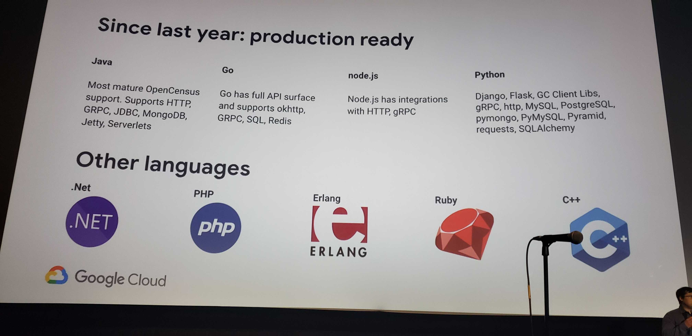
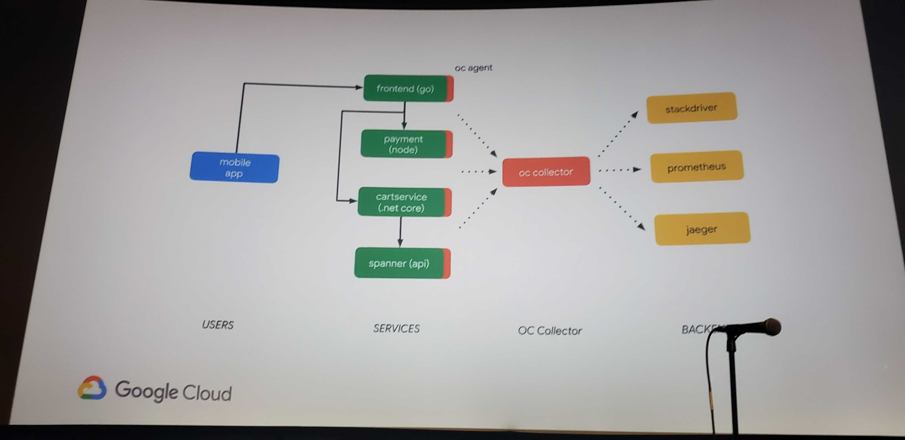
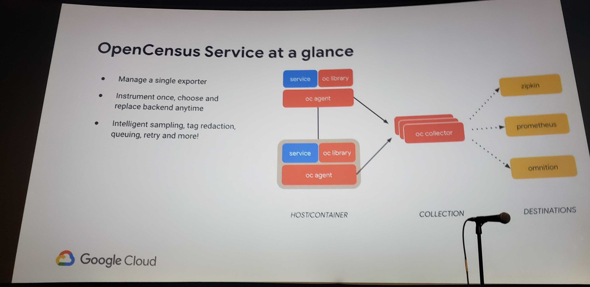
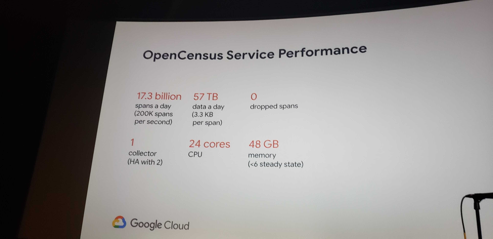
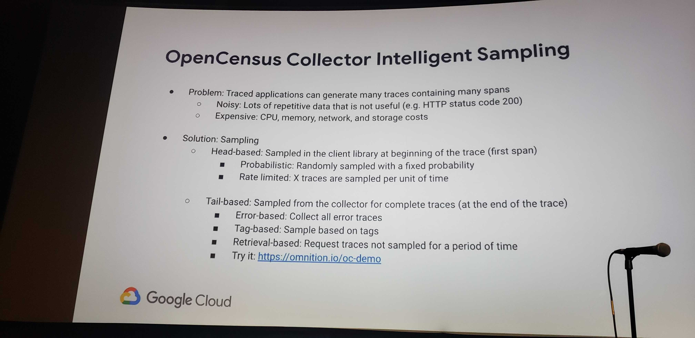
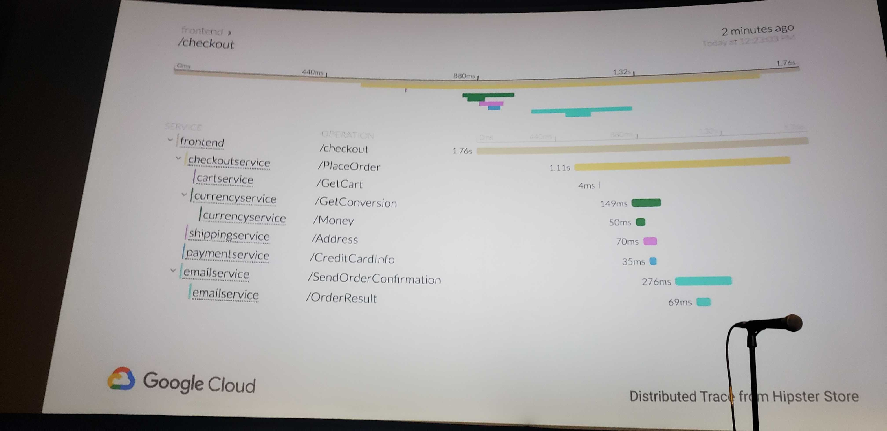
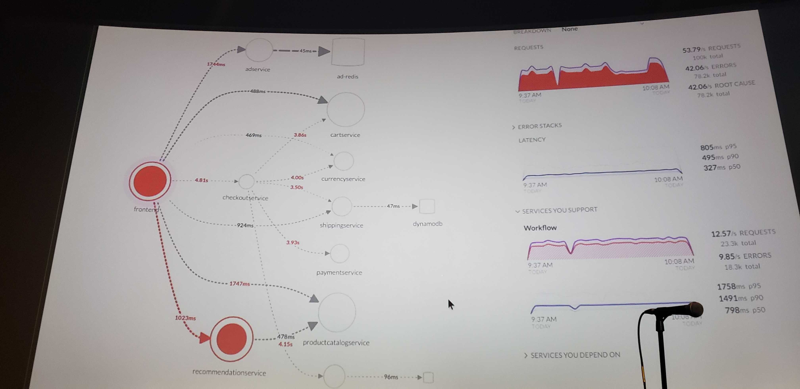
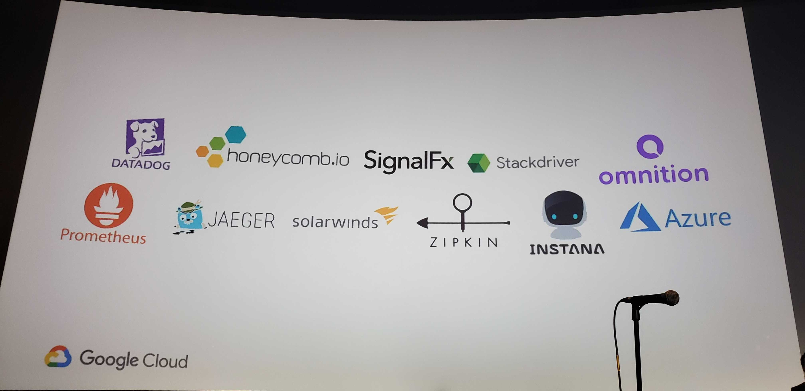

# Google Cloud Next 2019 Breakout: Complete Production Observability with OpenCensus
#gcp #cloud

- https://www.youtube.com/watch?v=259NX1-jrUQ

* TODO
	* **compare Zipkin vs. Prometheus vs. Jaeger**
* distributed tracing and metrics
	* context and tag propagation
* concerned with sending metrics to backend (exporters)
* can export to multiple backends at once
* will announce production readiness for python this month
	* see picture

* OpenCensus + OpenTracing merger = ?
	* new name at KubeCon EU
* candidate recommendation for W3C trace context specification
* OC (OpenCensus agent) = collects traces from apps and forwards to OC collector to forward to backends
	* see picture

* OpenCensus Client Libraries
	* instantiate tracer
	* setup exporter
	* define sampling policy
	* do work
		* create span
		* do actual work
		* end span
* OpenCensus Service

	* can be deployed as a binary, docker, kube sidecar
	* see picture for service performance

	* see picture for intelligent sampling

	* separate traces by
		* all traces
		* errors
* Distributed Tracing Demo
	* distributed hipster store app
		* see picture

	* construct hipster demo graph entirely from traces
		* see picture

* https://github.com/census-instrumentation

