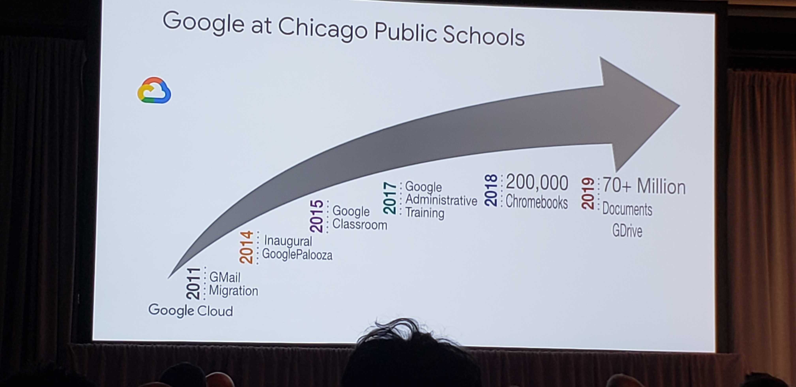
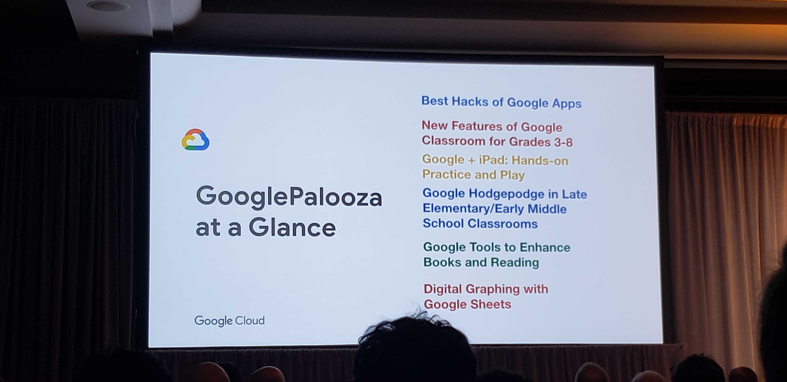

# Google Cloud Next 2019 Breakout: For Parents and Guardians: How Your Child Uses Google in Class
#gcp #cloud

- Googlers (Google for Education) visit schools and get feedback on Google technologies and other technologies
	- and try to experience school day as a student
- Built with students’ needs first
	- chromebooks
		- durable
		- apps available
	- GSuite for Education
	- Google Classroom
	- Google Expeditions in Action
		- Google cardboard for virtual field trips
	- g.co/beinternetawesome
		- practice best in internet safety
- As a parent how to get involved?
	- talk to teacher about Guardian feature
		- weekly digest of child’s activity
	- use Hangouts to meet with teachers
		- can show work directly on the screen
	- g.co/beinternetawesome
- Educator perspectives
	- In classroom: need parents to help shift to using technology to create
	- Conversations to have with children should be shifted:
		- “We have technology.”
			- Not enough just to have technology. Much more important to hear: “This is what we’re doing with technology.”
		- “We use technology.”
			- Should lead into: “This is why we use technology.”
				- Learning doesn’t always require technology.
		- “Students have access to technology”
			- Needs to be: “We access technology with purpose.”
- Consumption to Creation
	- CIO for Chicago public schools
	- paradigm has changed
		- true visionaries in any school district are in the classroom
		- listen to them, figure out ways to support teachers and students
	- true successful technology implemented in the classroom
		- transforms students from passive consumers -> creators
		- what tech empowers in the students
	- See picture for google transformation in their district

	- as an administrator
		- job is to help schools and teachers execute this transformation
	- what is the role of centralized IT for a school district
		- security 
			- constant vigilance
		- ensure the equitable distribution of technology
			- chromebooks - maximizes the dollar
				- levels the playing field in districts where kids have no access to technology
		- recognize centers of excellence in classroom practice and provide opportunities for cross pollination
			- figure out how to create collaboration opportunities between teachers
				- GooglePalooza
					- program that has 1500-2000 educators that teach how to use technology
					- see picture

		
			
