# Google Cloud Next 2019 Breakout: Making Planet Scale Geospatial Processing Possible with BigQuery GIS
#gcp #cloud

* Descartes Labs - Founding team from Los Alamos National Laboratory 2014 Santa Fe, NM
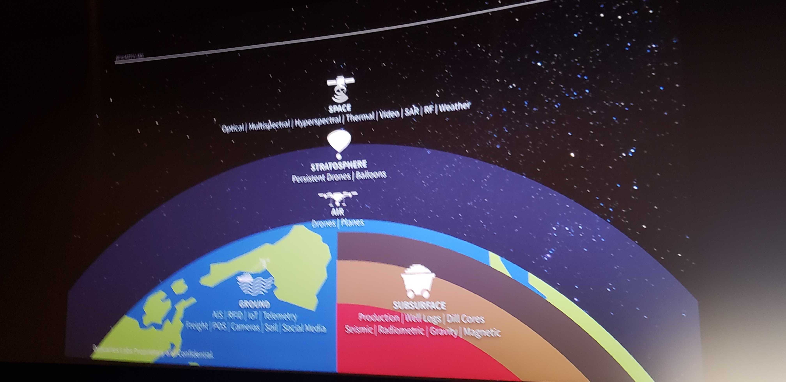
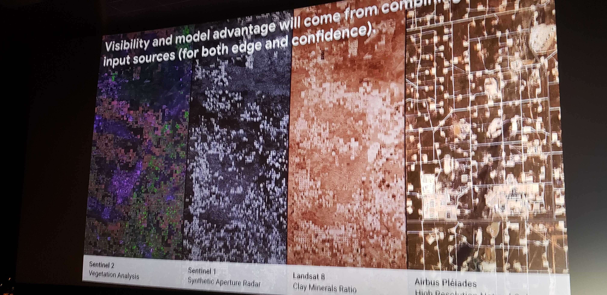
* BigQuery GIS available
	* features
		* see picture

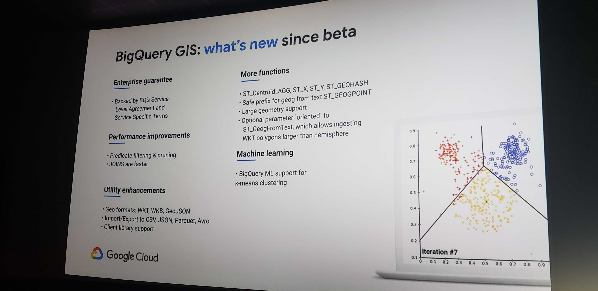

* train model that can identify boat type by it’s pattern
* find the “dark fleet”
	* mostly likely ships that don’t send out AIS pings are a part of the dark fleet
	* use Sentinel-1 to process coastlines
		* ~1 PB data
		* use Google Earth Engine
			* data catalog + computation platform
		* do smart interpolation to match detected ships and AIS datasets in BigQuery
			* do JOIN on AIS data (WKT) and identify which vessels match up with detections from radar
			* see picture
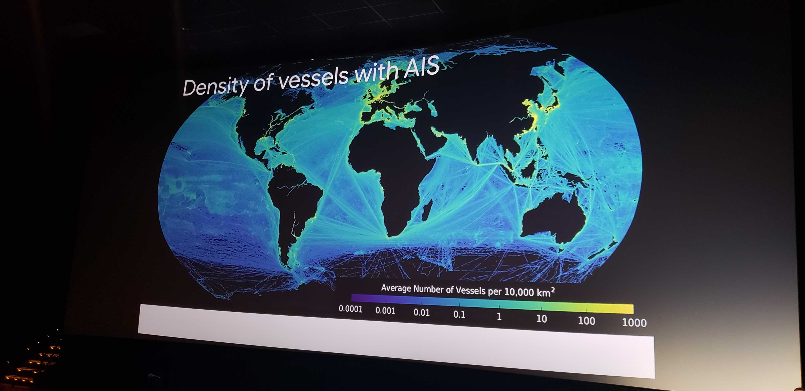
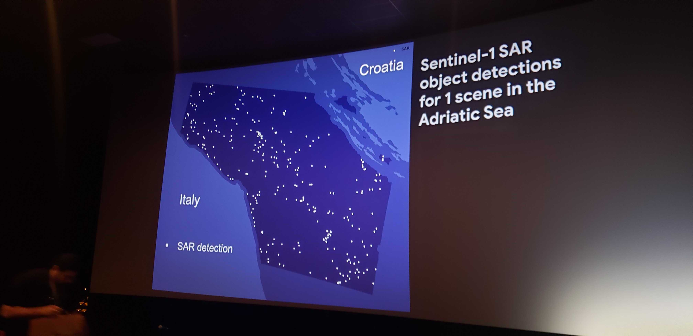
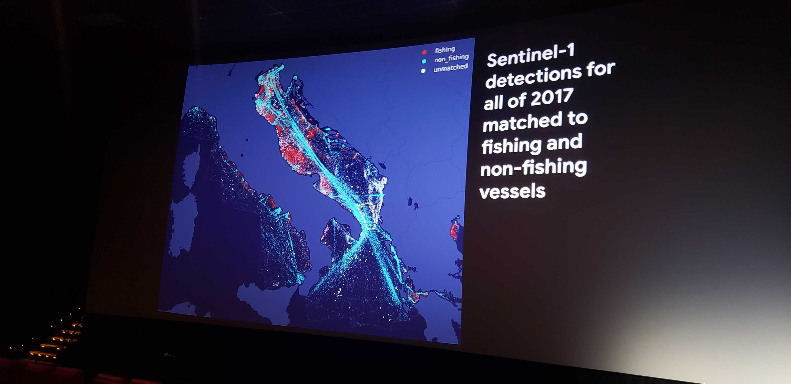
* BigQuery GIS
	* S2 Geometry Library
		* low-level library doing geometry on earth’s surface
		* open source
		* https://s2geometry.io
		* https://github.com/google/s2geometry
		* see picture
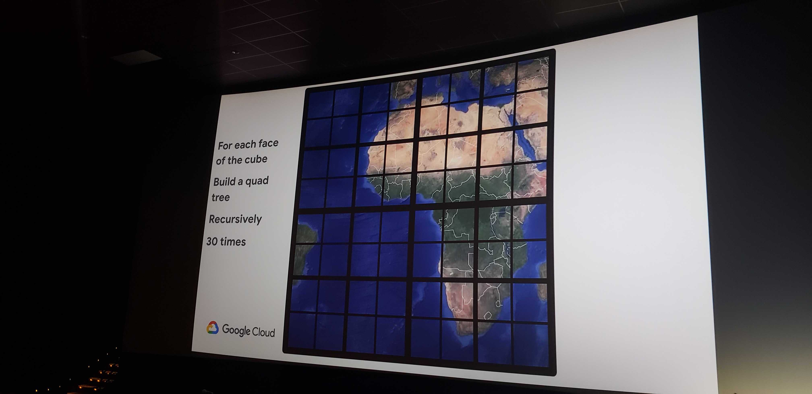
	* compute the coverage of every shard of data

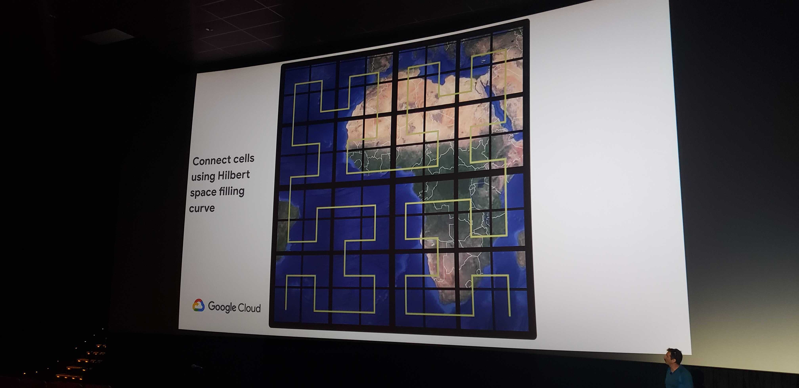
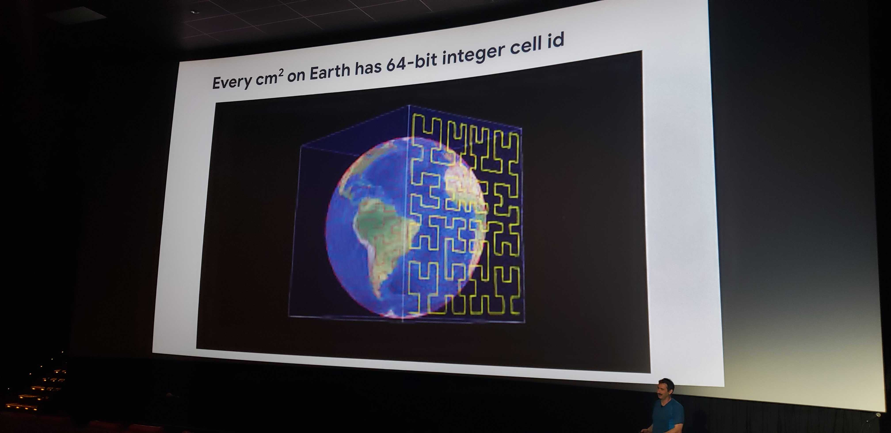
	* prune out partitions
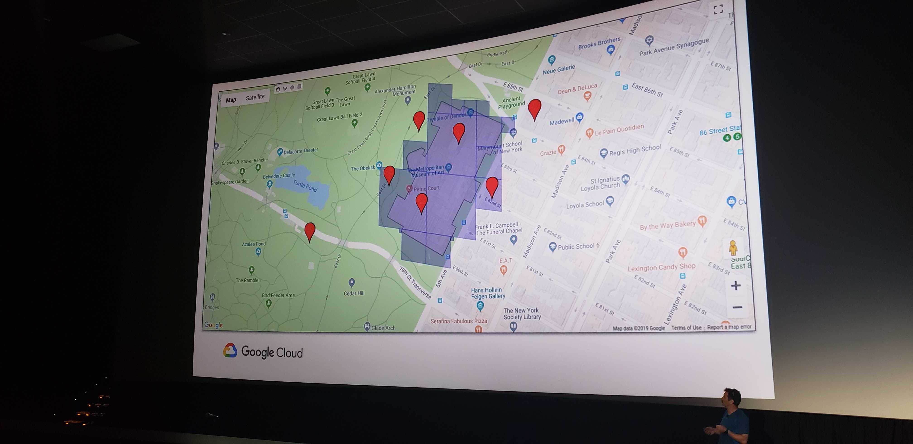
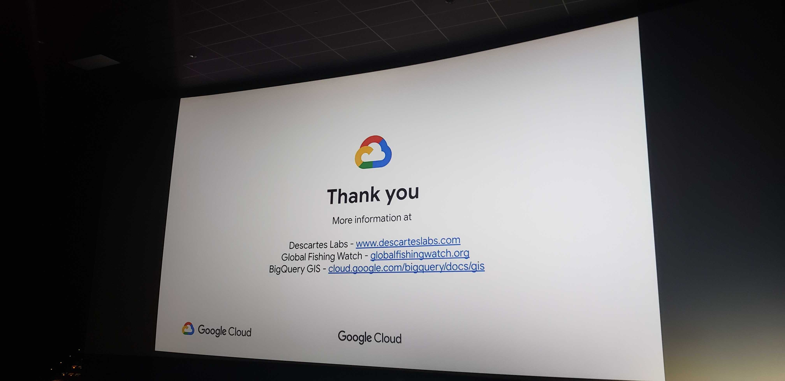
