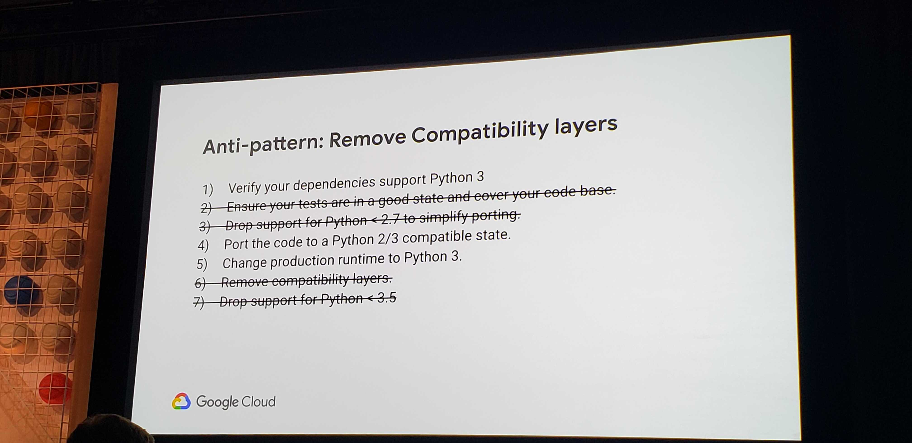
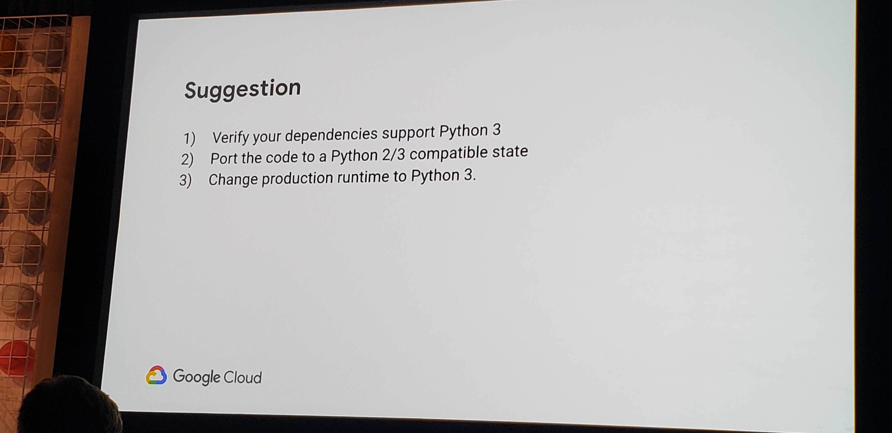

# Google Cloud Next 2019 Breakout: Python 2 to 3: Migration Patterns & Motivators
#gcp #cloud #python

- python timeline
	- 2.7.16 - latest version 
	- 2 more bug fix releases
	- 2.7.18 will be last
- EOL was supposed to be May 2015
- actual differences
	- breaking changes
		- core types
		- core operators
		- syntax
		- std libs moved, removed, renamed
	- why introduce breaking changes
		- longevity - course correction to prevent stagnation
		- fix python2 unicode to first-class support
		- integer division
		- classi classes
- why to migrate
	- new features
		- first-class unicode support
			- all strings are unicode by default
		- integer division
			- 2/3 = 0 vs. 2/3 = 0.6666666666
		- new-style classes
			- now `class Foo` vs. `class Foo(object)`
		- unicode variable names
		- f-strings
```
place = “world”
f”hello {place}”
```
		- new standard library modules
	- new products
		- Cloud Functons
		- App Engine
	- third-parties dropping support
		- numpy, pandas, tensor flow, and more
	- runtime security
		- EOL means no security updates
	- runtime support
		- no 2.8
		- 2.7 EOL is Jan 1, 2020
	- cost
		- don’t be an edge case
- migration patterns
	- “suggested migration steps”
		- see picture

		- seems reasonable and too focused on libraries
- anti-patterns
	- see picture

- a realistic migration pattern
	- see picture and declare victory

- migration tools
	- compatibility libs
		- six
		- future
	- migration tools
		- 2to3
			- ships with Python
			- extensible
			- not backward compatible (but why?)
		- modernize/six
		- futurize
			- concept of staged migration
			- **google leverages future**
				- more thorough than six
			- drastic increase in imports in all these tools
	- these tools aren’t perfect
		- can’t help you with such things as sorting an array of different objects
	- bytes vs. text
		- understand what type you mean objects to be
		- make sure in all open calls you specify bytes
		- consider using `io.open()`
			- you get a consistent interface
	- why is there no magic tool?
		- sometimes it requires understanding of what the intent is
		- sometimes the tool exposes a bug
	- Google Cloud specifics
		- 
